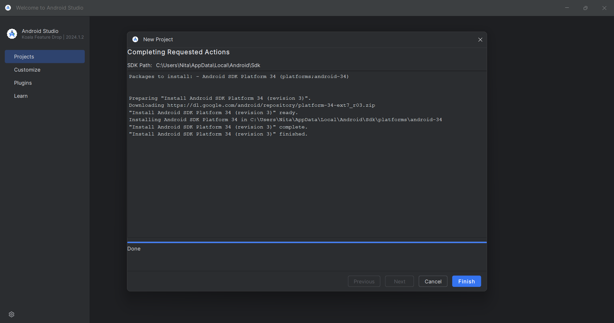
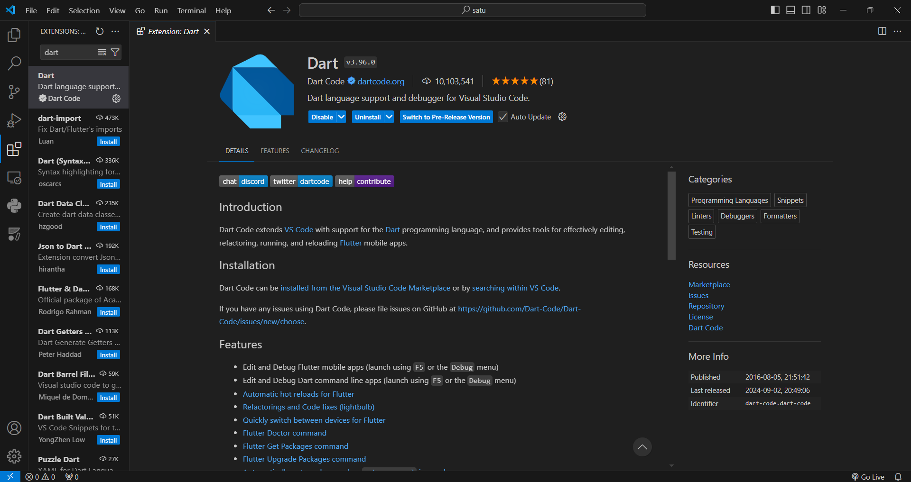

# MODUL 1. RUNNING MODUL
# Nadia Putri Rahmaniar

## Git
<!-- Tampilan versi Git yang telah terinstal -->

## Instalasi JDK
<!-- Tampilan JDK saat di ENV -->

<!-- Tampilan lokasi instalasi JDK saat di CMD -->

## Instalasi Flutter SDK
<!-- Tampilan Flutter saat di ENV -->

<!-- Instal komponen Flutter -->

## Instalasi Android Studio
<!-- Tampilan instalasi Android Studio -->

<!-- Tampilan Android Studio saat dijalankan -->

## Instalasi SDK Android

## Instalasi Visual Studio Code
<!-- Versi Visual Studio Code yang digunakan -->

## Instalasi Extension Visual Studio Code
<!-- 1. Dart -->

<!-- 2. Flutter -->

