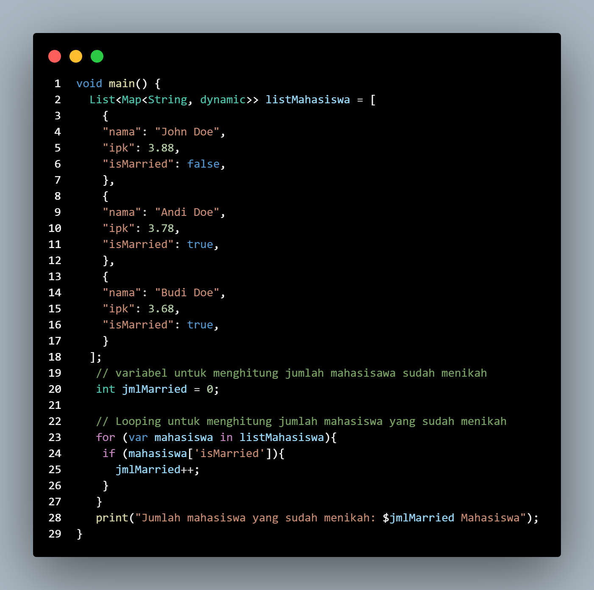

# Rerata IPK & Jumlah Mahasiswa Menikah

## Deskripsi
- Program Dart ini menghitung:
    - Rerata IPK dari daftar mahasiswa.
    - Jumlah mahasiswa yang sudah menikah.

## Struktur Data
- List of Maps berisi:
    - nama: Nama mahasiswa (String)
    - ipk: Nilai IPK (double)
    - isMarried: Status pernikahan (boolean)

## Kode Program
Source Code task 1

Output Task 1

Source Code Task 2

Output Task 2

