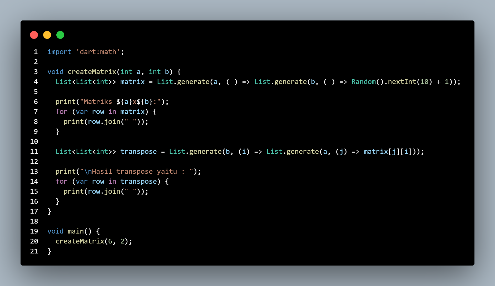
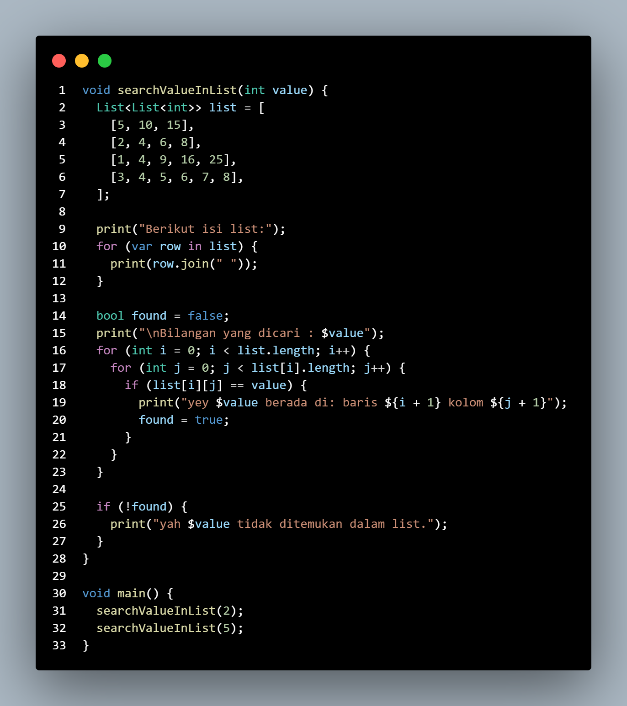
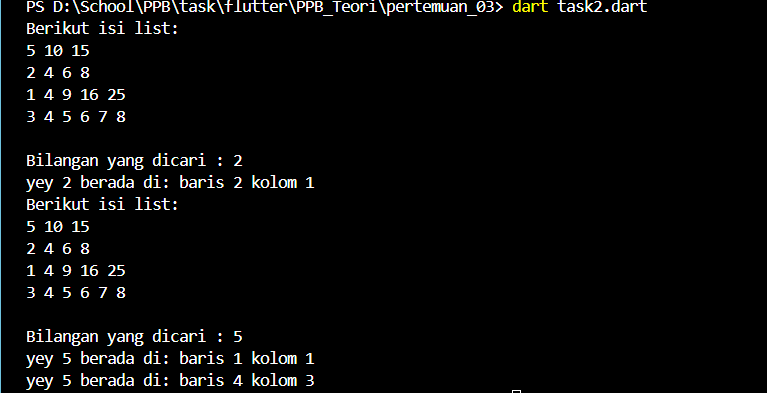
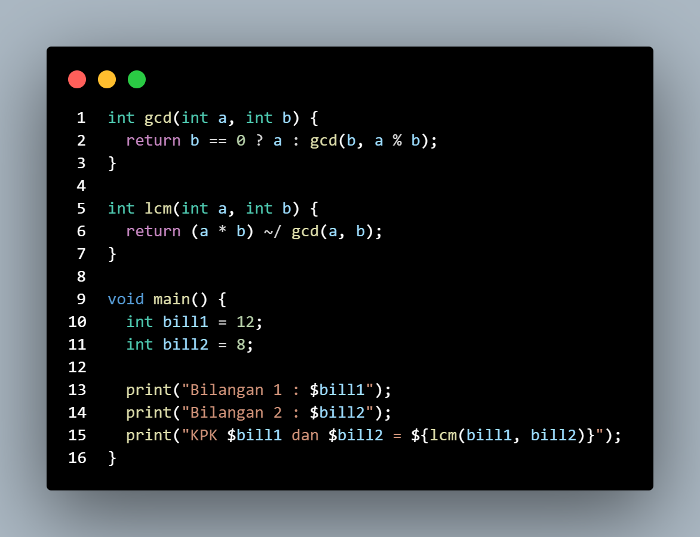
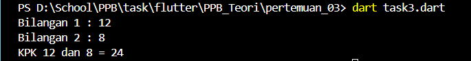

# Dart Operasi Matriks dan Bilangan

Proyek Dart ini mencakup tiga fungsi yang melaksanakan operasi matriks, pencarian nilai dalam daftar dua dimensi, dan perhitungan Kelipatan Persekutuan Terkecil (KPK) untuk dua bilangan bulat. Fungsi-fungsi ini menggambarkan keterampilan dasar dalam pemrograman Dart, seperti penggunaan daftar, pengulangan bersarang, dan perhitungan aritmatika.

## Fitur

1. Pembuatan Matriks dan Transposisi: Membuat matriks dengan ukuran tertentu dan menampilkan hasil transposisinya.  
2. Pencarian Nilai dalam Daftar 2 Dimensi: Mencari nilai integer tertentu dalam daftar dua dimensi yang telah ditentukan dan menampilkan letaknya.  
3. Perhitungan KPK: Menghitung Kelipatan Persekutuan Terkecil (KPK) dari dua bilangan bulat.

## Contoh Output

### Pembuatan Matriks dan Transpose
Fungsi createMatrix membuat matriks dengan ukuran AxB dan menampilkan transposenya.

Code Program task 1

Output

### Pencarian Nilai dalam List 2 Dimensi
Fungsi searchValueInList mencari nilai integer dalam list 2 dimensi dan menampilkan posisinya.

Code Program task 2

Output 

### Perhitungan KPK
Fungsi lcm menghitung KPK dari dua bilangan bulat.

Code Program task 3

Output

